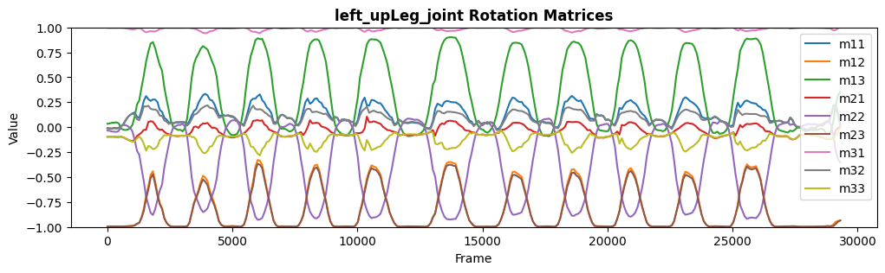
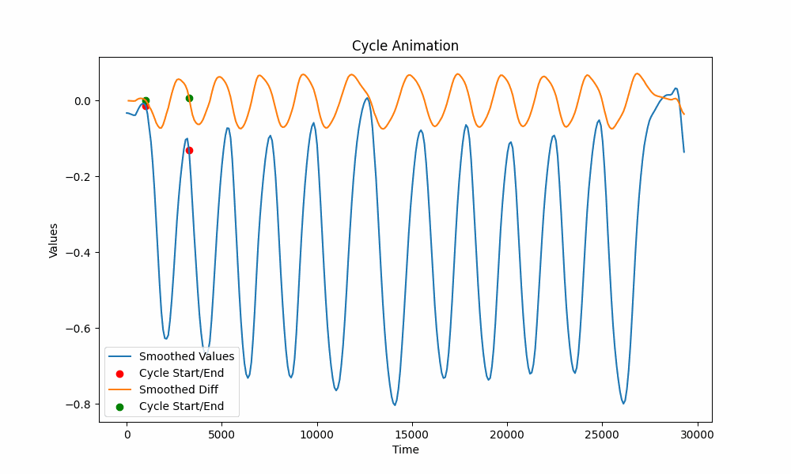

 

# FlexiTrace Repetition Count

FlexiTrace's vision is to make 3D motion analysis accessible to everyone
Our mission is to provide lab-quality movement analysis to your smartphone. We do this by using augmented reality and vision to capture your movement in 3D space. This data is then analyzed by our algorithms to provide you with insights into your movement, such as your range of motion, power output, and efficiency.

Now we are analyzing movement patterns using the FlexiTrace app's dataset for motion analysis.

## Table of Contents
- [Introduction](#introduction)
- [Getting Started](#getting-started)
- [Usage](#usage)
- [Results](#results)
- [Contributing](#contributing)
- [License](#license)

## Introduction

This project explores the FlexiTrace dataset, which includes spatial coordinates and transformation matrices for 91 joints detected using Apple's Kit. The goal is to analyze movement patterns, particularly repetitions during exercises.

## Getting Started

To get started, follow these steps:
- Clone this repository
```bash
git clone git@github.com:flexitrace/FlexiAI_CycleDetection.git && cd FlexiAI_CycleDetection
```
- Install the required dependencies
* For clean installation create a new environment and activate it
 ```bash
python3.8 -m venv .venv
source .venv/bin/activate
pip install -r requirements/local.txt
 ```


## Usage
- Cycle Detection on Rotation matrix
- Repetitions Cycle Duration
- Repetitions Count

## Dataset Parameters

The `alljoint.csv` file provided for each dataset sample includes the parameters that were used to generate that specific sample. For convenience, we provide a description of each parameter below:

- **`Frame_Order`**: Represents the order or timestamp of the frame within the dataset.
- **`Anchor_Name`**: Denotes the name or identifier of the anchor used in the sample.
- **`Anchor_Anatomy_Name`**: Describes the anatomy or characteristics of the anchor used.
- **`Created_At`**: Indicates the timestamp when the sample was created or recorded.
- **`Local_Position_x/y/z`**: Represents the local position coordinates (**x**, **y**, and **z**) of an object in the sample's local space.
- **`World_Position_x/y/z`**: Indicates the world position coordinates (**x**, **y**, and **z**) of an object in the sample's global space.


## Results

### Visualizing 3D Joint Rotation Matrices for Hips Joint

I captured a square exercise using the FlexiTrace app and began evaluating the results. Below is a visualization of the 3x3 rotation matrix indexes for the hips joint:

<!--  -->


### Detecting Repetition Cycles

To identify repetition cycles, I used a difference calculation and detected peaks in the data. The GIF below illustrates the detected repetition cycle for the hips joint:

<!--  -->


### Applying the Method to All Transformation Matrix Indexes

I extended this method to all indexes of the transformation matrix and plotted the repetition cycle and cycle duration in my dataset. The GIF below shows the 3x3 results of the repetition count for all transformation matrix indexes:

<!--  -->


By using this approach, I can accurately count the repetitions of an exercise.

## Contributing

Contributions are welcome! If you'd like to contribute to this project, please follow these steps:
- Fork the repository.
- Create a new branch for your feature or bug fix.
- Make your changes.
- Submit a pull request.


