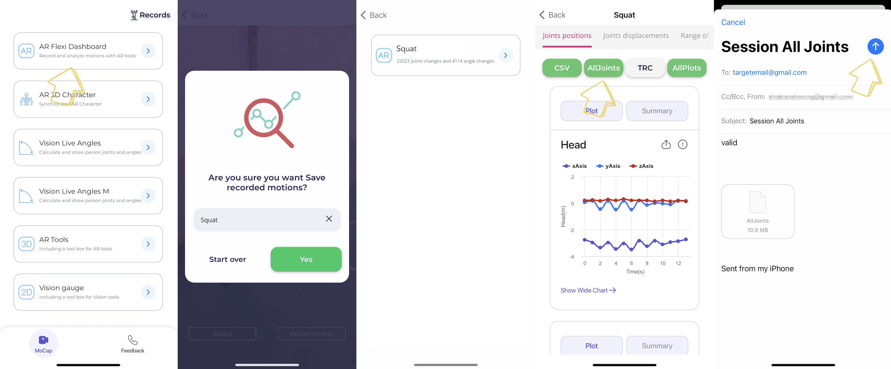

<!--  -->

# FlexiTrace Cycle Detection
<a href="https://colab.research.google.com/drive/1jUpoqAf2t5UbK9rZvaSo1BtRFsqmZI9L?authuser=2"></a>

[FlexiTrace Sports Biomechanics](https://apps.apple.com/app/flexitrace-sports-biomechanics/id6462847881), an innovative markerless motion capture app, offers you a unique opportunity to delve into the captivating world of human movement analysis. With an extensive dataset featuring spatial coordinates and transformation matrices for 91 joints, meticulously captured through [ARKit’s body-tracking](https://developer.apple.com/documentation/arkit/arkit_in_ios/content_anchors/validating_a_model_for_motion_capture), FlexiTrace provides a gateway to explore real-life exercise data like never before. Our vision is to democratize [3D motion analysis](https://flexitrace.com/blog/physics-engine.html), making it accessible to all. By leveraging augmented reality and advanced computer vision, we transform your smartphone into a portable lab, enabling the analysis of your movement's depth and nuances. Join us as we decipher movement patterns within the FlexiTrace app's dataset, and embark on a journey to enhance your understanding and optimize your performance in the realm of human motion.


## Table of Contents

- [Introduction](#introduction)
- [Getting Started](#getting-started)
- [Usage](#usage)
- [Results](#results)
- [Contact](#Contact)

## Introduction: 

**Uncover the Essence of Movement with FlexiTrace in 5 Simple Steps:**

1. **Open the AR Flexi Dashboard:** Dive into the world of FlexiTrace by accessing our intuitive dashboard, your gateway to a wealth of movement insights.

2. **Capture and Visualize:** Record your chosen exercise or movement, and witness FlexiTrace transform it into a captivating plot, revealing every subtle detail.

3. **Preserve Your Discoveries:** Safeguard your valuable insights by saving the generated plot, ensuring they remain exclusively yours. 

4. **Customize Export Formats:** FlexiTrace offers versatile export options, allowing you to share your discoveries in your preferred format.

5. **Collaborate with Ease:** Share your findings effortlessly by entering your email and tapping the send icon, connecting with fellow movement analysis enthusiasts, colleagues, and collaborators.Rest assured, FlexiTrace respects your privacy, and your data is never used or saved by the app. It can only be emailed to your iCloud or Gmail, putting you in complete control of your information. Welcome to the future of motion exploration with FlexiTrace.
<div align="center">

</div>
</br>

Ready to embark on your journey of movement discovery? Visit our [Website](https://flexitrace.com/) for more information and insights. You can also download FlexiTrace on the [App Store](https://apps.apple.com/app/flexitrace-sports-biomechanics/id6462847881) to start your exploration today!


## Getting Started

To begin your data analysis journey, follow these simple steps:

- Clone the Repository: 
```bash
git clone git@github.com:flexitrace/FlexiAI_CycleDetection.git && cd FlexiAI_CycleDetection
```

- Install the required dependencies

    * For clean installation create a new environment and activate it

```bash
python3.8 -m venv .venv
source .venv/bin/activate
pip install -r requirements/local.txt
```

## Usage

Unlock the full potential of FlexiTrace with these exciting features:

- **Cycle Detection on Rotation Matrix**: Dive into the core of movement patterns based on rotation matrices. Uncover the graceful flow of motion cycles.
- **Repetitions Cycle Duration**: Analyze the duration of repetitions with precision. Analyze the exact duration of repetitions to fine-tune your performance and progress.
- **Repetitions Count**: Keep track of every repetition effortlessly. Whether it's for fitness, sports, or research, count them all and gain valuable insights.

FlexiTrace empowers you to transform raw data into actionable insights, making your analysis both engaging and informative.

## Dataset Parameters

Now we are analyzing movement patterns using the FlexiTrace app's dataset for motion analysis.

The ALLJoints.csv file provided for each dataset sample includes the parameters that were used to generate that specific sample. For convenience, we provide a description of each parameter below:

- **Frame_Order**: Represents the order or timestamp of the frame within the dataset.
- **Anchor_Name**: Denotes the name or identifier of the anchor used in the sample.
- **Anchor_Anatomy_Name**: Describes the anatomy or characteristics of the anchor used.
- **Created_At**: Indicates the timestamp when the sample was created or recorded.
- **Local_Position_x/y/z**: Represents the local position coordinates (**x**, **y**, and **z**) of an object in the sample's local space.
- **World_Position_x/y/z**: Indicates the world position coordinates (**x**, **y**, and **z**) of an object in the sample's global space.

## Results

### Visualizing 3D Joint Rotation Matrices for Hips Joint

I captured squat exercise using the FlexiTrace app and began evaluating the results. Below is a visualization of the 3x3 rotation matrix indexes for the hips joint:

<div align="center">

</div>

### Detecting Repetition Cycles

To identify repetition cycles, we used a difference calculation and detected peaks in the data. The GIF below illustrates the detected repetition cycle for the hips joint:

<div align="center">

</div>

### Applying the Method to All Transformation Matrix Indexes

we extended this method to all indexes of the transformation matrix and plotted the repetition cycle and cycle duration in my dataset. The GIF below shows the 3x3 results of the repetition count for all transformation matrix indexes:

<div align="center">

</div>
</br>
By using this approach, we could accurately count the repetitions of the squat exercise.

<!-- ## Contributing

Contributions are welcome! If you'd like to contribute to this project, please follow these steps:

- Fork the repository.
- Create a new branch for your feature or bug fix.
- Make your changes.
- Submit a pull request. -->

## Contact
For FlexiTrace Cycle Detection bug reports and feature requests, please visit our [GitHub Issues](https://github.com/flexitrace/FlexiAI_CycleDetection/issues). Join our social media community for questions and discussions!
<br>
<div align="center">
  <a href="https://github.com/flexitrace/FlexiAI_CycleDetection" style="text-decoration:none;">
    </a>
  
  <a href="https://www.linkedin.com/company/flexitrace/" style="text-decoration:none;">
    </a>
  
  <a href="https://www.youtube.com/@FlexiTrace" style="text-decoration:none;">
    </a>
  
  <a href="https://www.tiktok.com/@flexitrace" style="text-decoration:none;">
    </a>
  
</div>